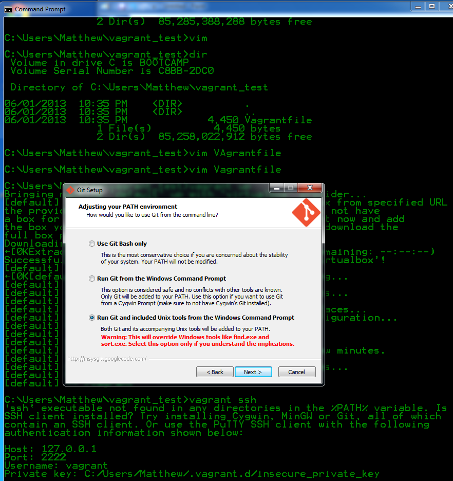

Fork from Mining the Social Web (2nd Edition)
=============================================

## Summary

This is a fork of the repository of iPython notebooks from the book "Mining the Social Web".

This fork is aimed to upgrade the vagrant based development environment so that it is working with current versions of Windows and OSX.

## Why a fork is necessary

The book comes with a vagrant based development environment, available via github. This is great to get new users started. However Unfortunately the toolchain is outdated, which lead to a couple of problems:

1. The vagrant file will only work with VirtualBox 1.3. This is a problem, because the current version (and default download) is now 1.5. On OSX VirtualBox will not install in version 1.3, due to security reasons.
2. The VirtualBox is based on ubuntu 12 with a couple of issues when you try to install newer software packages.
3. Some of the python modules won't install. As all python modules are installed via `pip install -r ...` a fatal error in one of the installs will lead to a situation were all modules have to be reinstalled by chef.
4. A lot of deprecated options in the installs, deprecated chef recipes (especially for python) and iPython is now jupyter.

So it is time to brush things up

## Status

Everything now installs properly with exception of Matplotlib. So the iPython notebooks are usable on Windows.

## Some tips and tricks to deal with disk space

### Move away from the primary disk
On my Windows 7 mashine the VMBox takes up about 1.5 to 5 GB of diskspace, vagrant uses around 750 MB. As I have a SSD as my first disk, I need to move this to my secondary disk.
To achieve this:
1. Create a new directory on your target disk. Set the VAGRANT_HOME environment variable to point to this directory. On Windows go to explorer (right click) -> "Erweiterte Systemeinstellungen" -> "Umgebungsvariablen".
2. Create a different new directory on your target disk for your VirtualBox. Open the VirtualBox app. In the settings, specify this directory to store the VirtualBox-files.

### Move VirtualBox to a flash-drive
On my MacBook I need to have ghe VirtualBox on a flash-drive. This leads however to some obstacles: vagrant will not be able to provision the virtual mashine, because the certificate to log in to the virtual box is fully accessible. For security reasons ssl
will not accept a fully accessible certificate, so vagrant can not log in to its created guest machine.
So after using `vagrant up` to download and install the virtual machine (takes 20 min) there might be an error with the permissions on the private-key file for the ssh to the virtual machine. In this case do the following:
  * let us assume that /project is the folder where the vagrant file lives.
  * So then goto /project/.vagrant/mashines/default/virtualtbox and copy the file to a local folder /home folder (let us assume /Users/username/certificates/), where you can change the file permissions via `chmod 0600 key_file`
  * now set the vagrant system to find the file in this folder:
  * open the vagrant file and add the last line below the two lines (so this block look as follows:)
  ```sh
  override.vm.box = "precise64"
  override.vm.box_url = "http://files.vagrantup.com/precise64.box"
  config.ssh.private_key_path = "/Users/username/certificates/private_key"
  ```
  * After using `vagrant destroy`  you first have to deactivate config.ssh.private_key_path again in the Vagrantfile, because the next `vagrant up` will create a new guest virtual machine, with a new and different certificate.


  ## Install of vagrant and virtual box
  * install [virtual box](https://www.virtualbox.org/wiki/Downloads). The target directory is fixed Unfortunately (Mac).
  * install [vargrant](https://www.vagrantup.com/downloads.html). The can be changed to point to a flash drive (Mac).
  * install git client for Windows. Do check (it's guarded by a warining) the git and bash command linen tools. Otherwise `vagrant ssh` will not work at all (Windows). Alternatively you could use putty to login to your guest machine.
  
  * clone the github repo from [GitHub](https://github.com/ptwobrussell/Mining-the-Social-Web-2nd-Edition/)

  ## Use some basic vagrant commands
  * Use `vagrant up` to download and install the guest machine (also use this to bring the virtual machine up after halt or suspend)
  * Use `vagrant status` to check whether the vagrant machine is up and running.
  * you might have to update via `vagrant box update`
  * start and stop vagrant via `vagrant up` and `vagrant halt` (do not use `vagrant suspend` in most cases)
  * use `vagrant provision` to start the provisioning of the machine. In our case this will start the chef machinery to install the python environment. You can restart this command.
  * Use `vagrant destory` if you have to restart completly from scratch or have to reuse the disk space.

  ## Maintenance
  * go to the folder that contains the vagrantfile and isue `vagrant plugin install vagrant-vbguest`
  * see this [blog](http://kvz.io/blog/2013/01/16/vagrant-tip-keep-virtualbox-guest-additions-in-sync/) for details.
